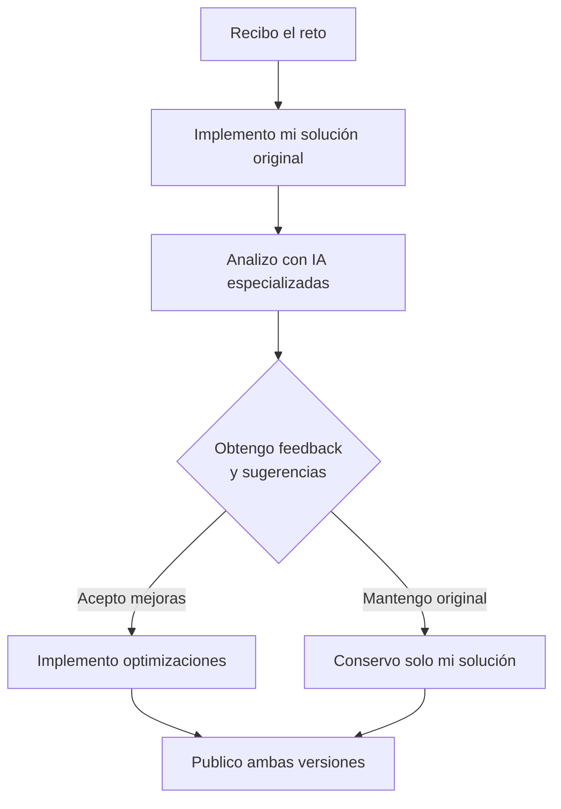

<div align="center">

# 🧠 Soluciones a Retos de Programación - Academia Midudev  

[](https://midu.dev/academy "Acceder a la academia MIDUDEV")


</div>  

Bienvenido/a a mi repositorio personal de soluciones a los retos de programación propuestos por la Academia de Midudev. Este espacio documenta mi proceso de aprendizaje, reflexión y mejora continua como desarrollador.

## 📌 ¿Qué encontrarás aquí?
- Mis soluciones originales a cada reto, implementadas con mi propio criterio y conocimiento.
- Versiones optimizadas basadas en análisis y sugerencias de IA especializadas en desarrollo.
- Proceso transparente de revisión, feedback y mejora de código.
- Índice organizado que permite navegar fácilmente entre los desafíos resueltos.

## 🔄 Mi Metodología de Trabajo


## 📁 Estructura del Repositorio
```
🧠 Soluciones a Retos de Programación - Academia Midudev 
├── 📂 30 Días JS/
│   ├── 📄 1.🧙 El códice de Arkanus.js
│   ├── 📄 #1.js
|   ├── 📄 # Nombre del reto precedido de su numero de orden.js
|   ├── 📄 ## Numero de orden del reto precedido del símbolo de número (Se refiere a optimización).js
│   └── 📄 README.md (explicación si es necesario)
├── 📂 Otro-plan-de-estudio/
│   ├── 📄 #.solucion-original.js
│   └── 📄 ##.js Optimización
├── 📄 Readme.md
```
## 📊 Índice de Soluciones

|Plan|Reto|Solución Original|Solución Optimizada|Estado|Dificultad|
|:--:|:-:|:---------------:|:-----------------:|:----:|:--------:|
|30 Días JS|
||[🧙 El códice de Arkanus](https://midu.dev/retos/30-dias-de-javascript/el-codice-de-arkanus "Acceder al reto en la academia")|[📄Ver Código](/30%20Dias%20JS/1.🧙%20El%20códice%20de%20Arkanus.js)|[♻️Ver Optimización](/30%20Dias%20JS/%231.js)|✅|

***Leyenda de estados:***  
***Estado:*** ✅ Completado · 🔄 En revisión · 🚧 En progreso  
***Dificultad:***    

