# 🧠 Soluciones a Retos de Programación - Academia Midudev  

  

Bienvenido/a a mi repositorio personal de soluciones a los retos de programación propuestos por la Academia de Midudev. Este espacio documenta mi proceso de aprendizaje, reflexión y mejora continua como desarrollador.

## 游늷 쯈u칠 encontrarás aquí?
- Mis soluciones originales a cada reto, implementadas con mi propio criterio y conocimiento.
- Versiones optimizadas basadas en análisis y sugerencias de IA especializadas en desarrollo.
- Proceso transparente de revisión, feedback y mejora de código.
- Índice organizado que permite navegar fácilmente entre los desafíos resueltos.

## 🔄 Mi Metodología de Trabajo

```mermaid
flowchart TD
    A[Recibo el reto] --> B[Implemento mi solución original]
    B --> C[Analizo con IA especializadas]
    C --> D{Obtengo feedback<br>y sugerencias}
    D -->|Acepto mejoras| E[Implemento optimizaciones]
    D -->|Mantengo original| F[Conservo solo mi solución]
    E --> G[Publico ambas versiones]
    F --> G
```

